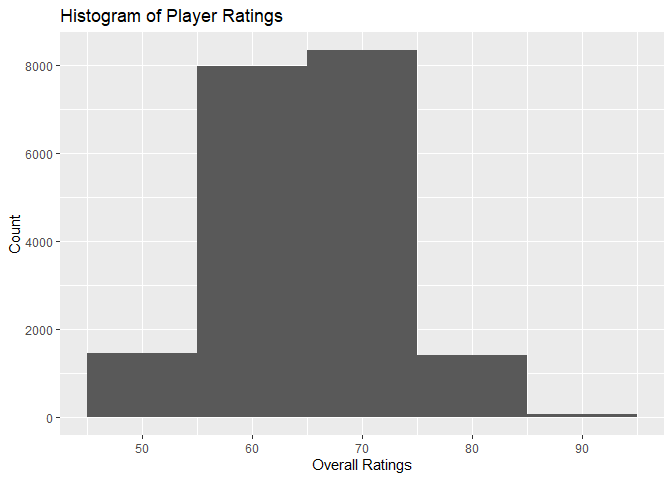
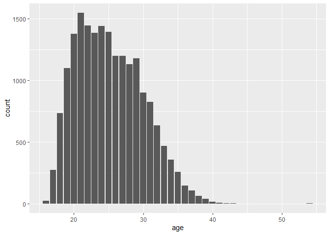
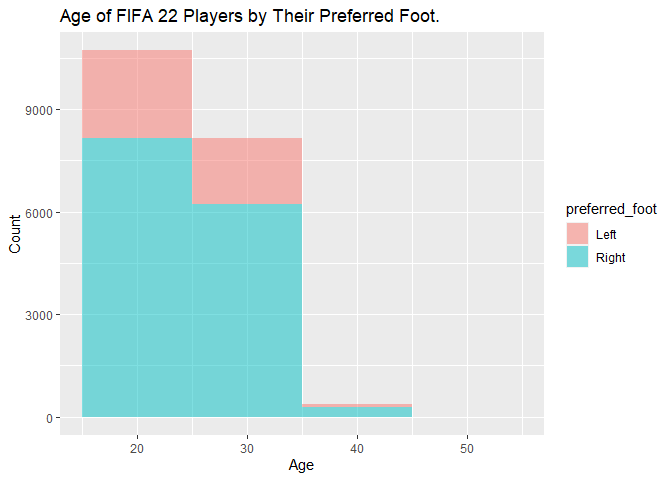
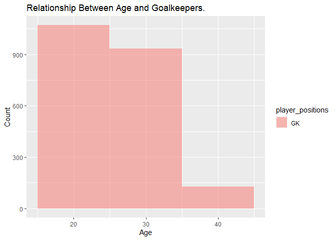
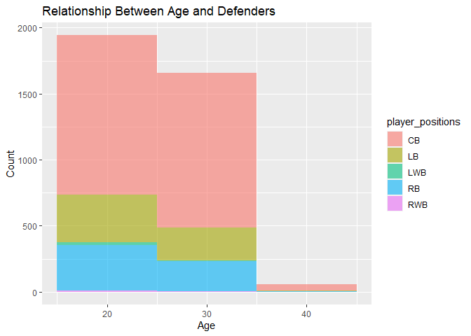
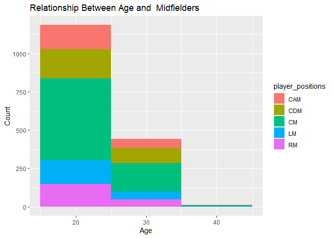
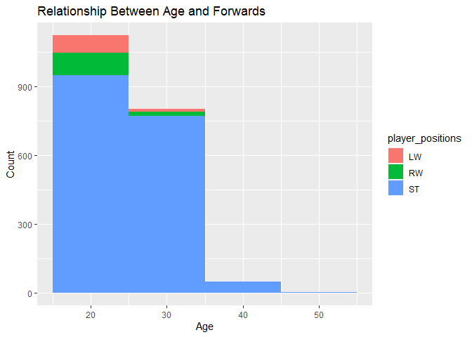
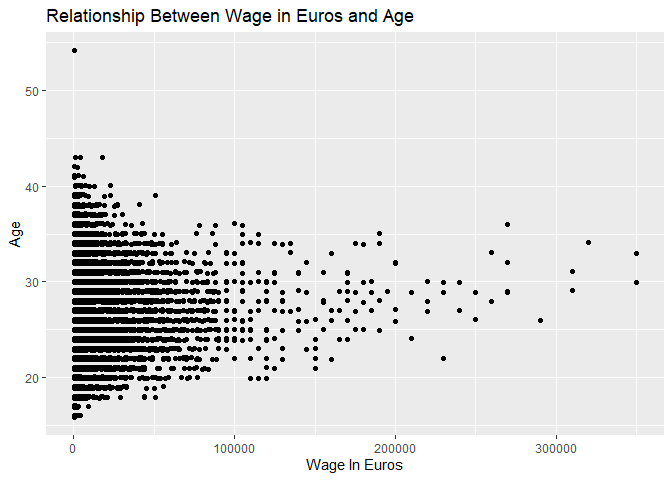
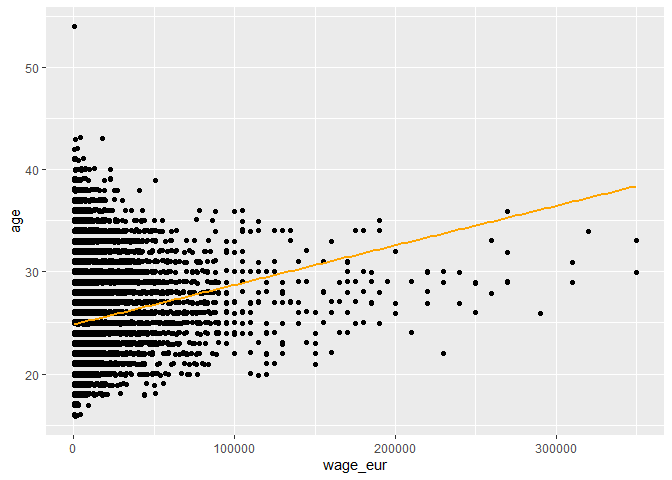

# FIFA 22
Xavier Silverio
2024-02-12

This is my analysis of the FIFA 2022 Data set. The dataset was found on
sportsstatistics.com, a website created by Thomas Nielsen. Created on June 16, 2022, 
the data contains player statistics from the video game FIFA 22. 
``` r
#Loading in necessary libraries and removing unwanted messages. 
library(tidyverse)
```

``` r
library(tidymodels)
```

``` r
knitr::opts_chunk$set(warning = FALSE, message = FALSE)
options(scipen=999)
```

``` r
#Loads in FIFA Dataset 
fifa <-  read_csv(file = "data/players_22.csv")
fifa
```

    # A tibble: 19,239 × 110
       sofif…¹ playe…² short…³ long_…⁴ playe…⁵ overall poten…⁶ value…⁷ wage_…⁸   age
         <dbl> <chr>   <chr>   <chr>   <chr>     <dbl>   <dbl>   <dbl>   <dbl> <dbl>
     1  158023 https:… L. Mes… Lionel… RW, ST…      93      93  7.8 e7  320000    34
     2  188545 https:… R. Lew… Robert… ST           92      92  1.20e8  270000    32
     3   20801 https:… Cristi… Cristi… ST, LW       91      91  4.5 e7  270000    36
     4  190871 https:… Neymar… Neymar… LW, CAM      91      91  1.29e8  270000    29
     5  192985 https:… K. De … Kevin … CM, CAM      91      91  1.25e8  350000    30
     6  200389 https:… J. Obl… Jan Ob… GK           91      93  1.12e8  130000    28
     7  231747 https:… K. Mba… Kylian… ST, LW       91      95  1.94e8  230000    22
     8  167495 https:… M. Neu… Manuel… GK           90      90  1.35e7   86000    35
     9  192448 https:… M. ter… Marc-A… GK           90      92  9.9 e7  250000    29
    10  202126 https:… H. Kane Harry … ST           90      90  1.30e8  240000    27
    # … with 19,229 more rows, 100 more variables: dob <date>, height_cm <dbl>,
    #   weight_kg <dbl>, club_team_id <dbl>, club_name <chr>, league_name <chr>,
    #   league_level <dbl>, club_position <chr>, club_jersey_number <dbl>,
    #   club_loaned_from <chr>, club_joined <date>,
    #   club_contract_valid_until <dbl>, nationality_id <dbl>,
    #   nationality_name <chr>, nation_team_id <dbl>, nation_position <chr>,
    #   nation_jersey_number <dbl>, preferred_foot <chr>, weak_foot <dbl>, …

``` r
#Checking number of rows and columns in the dataset
nrow(fifa)
```

    [1] 19239

``` r
ncol(fifa)
```

    [1] 110

There are 19,239 rows in this dataset, and there are 110 columns in this
dataset.

``` r
#Histogram of player ratings 
ggplot(fifa, aes(x = overall)) +
  geom_histogram(binwidth = 10,
                 alpha = 1) +
labs(x = "Overall Ratings",
       y = "Count",
       title = "Histogram of Player Ratings") 
```



It seems like most players in this FIFA dataset are between 65-75
overall.

``` r
#Barplot of players' ages 
ggplot(fifa, aes(x = age)) +
  geom_bar()
```



It seems like most players in this data set are between 20-30 years old.

``` r
# mean average rating for fifa players in this dataset. 
fifa %>%
  summarise(mean_ratings = mean(overall))
```

    # A tibble: 1 × 1
      mean_ratings
             <dbl>
    1         65.8

The average rating of players in this dataset is around 65 overall.

``` r
#Counting the number of names in FIFA
fifa %>%
  count(short_name, sort = TRUE)
```

    # A tibble: 18,145 × 2
       short_name       n
       <chr>        <int>
     1 J. Rodríguez    13
     2 J. Hernández     9
     3 J. Brown         8
     4 Paulinho         8
     5 J. García        7
     6 J. González      7
     7 L. Rodríguez     7
     8 M. Smith         7
     9 A. Rodríguez     6
    10 J. Clarke        6
    # … with 18,135 more rows

It seems like the most common name is J. Rodriguez.

``` r
#Checking who is the oldest player in the FIFA dataset

fifa %>% 
  group_by(short_name) %>%
  count(age, sort = TRUE) %>% 
  arrange(desc(age))
```

    # A tibble: 19,144 × 3
    # Groups:   short_name [18,145]
       short_name         age     n
       <chr>            <dbl> <int>
     1 K. Miura            54     1
     2 C. Lucchetti        43     1
     3 G. Buffon           43     1
     4 S. Nakamura         43     1
     5 D. Vaca             42     1
     6 K. Ellison          42     1
     7 A. Boruc            41     1
     8 J. Pinto            41     1
     9 K. Stamatopoulos    41     1
    10 P. Da Silva         41     1
    # … with 19,134 more rows

Not surprisingly, the oldest player in FIFA 22 is Miura, who is 54 years
old.

``` r
#Age of FIFA 22 players by their preferred foot. 
ggplot(fifa, aes(x = age,
               fill = preferred_foot)) +
  geom_histogram(binwidth = 10,
                 alpha = 0.5) +
  labs(x = "Age",
       y = "Count",
       title = "Age of FIFA 22 Players by Their Preferred Foot.") 
```



In this data set, it seems that most players are right footed.

``` r
#Finding out relationship between age and position


#Goalkeepers
fifa%>% 
  filter(player_positions == "GK") %>% 
ggplot(aes(x = age,
               fill = player_positions)) +
  geom_histogram(binwidth = 10,
                 alpha = 0.5) +
  labs(x = "Age",
       y = "Count",
       title = "Relationship Between Age and Goalkeepers.") 
```



``` r
#Defenders
fifa %>% 
filter(player_positions == "CB" | player_positions == "RB" | player_positions =="LB" | player_positions == "RWB" | player_positions == "LWB") %>% 
ggplot(aes(x = age,
               fill = player_positions)) +
  geom_histogram(binwidth = 10,
                 alpha = 0.6) +
  labs(x = "Age",
       y = "Count",
       title = "Relationship Between Age and Defenders") 
```



``` r
#Central Midfielders
fifa %>% 
filter(player_positions == "CM" | player_positions == "CDM" | player_positions == "CAM" | player_positions == "RM" | player_positions == "LM") %>% 
ggplot(aes(x = age,
               fill = player_positions)) +
  geom_histogram(binwidth = 10,
                 alpha = 3.9) +
  labs(x = "Age",
       y = "Count",
       title = "Relationship Between Age and  Midfielders") 
```



``` r
#Forwards
fifa %>% 
filter(player_positions == "LW" | player_positions == "RW" | player_positions == "ST") %>% 
ggplot(aes(x = age,
               fill = player_positions)) +
  geom_histogram(binwidth = 10,
                 alpha = 4.9) +
  labs(x = "Age",
       y = "Count",
       title = "Relationship Between Age and Forwards") 
```



It looks like the most common position for 35-45 years old is
Goalkeeper. Most players by position seem to be between 15-25 years old.
In this dataset, the most common defender position is center back. The
most common midfield position seems to be central midfielder. The most
common forward position seems to be striker.

``` r
#Finding relationship between wage in Euros and age. 
ggplot(fifa, aes(x = wage_eur, y = age)) +
geom_jitter(width = 0.1, height = 0.1) +
  labs(x = "Wage In Euros",
       y = "Age",
       title = "Relationship Between Wage in Euros and Age") 
```



It seems like most data points are on the left of the graph, for most
players in this FIFA dataset are earning between 0-100,000 Euros per
week.

``` r
#Fitting linear model to predict wage in euros by age. 
wage_age_fit <- linear_reg() %>%
  set_engine("lm") %>%
  fit(wage_eur ~ age, data = fifa) %>%
  tidy()
estimate1 <- wage_age_fit$estimate[1]
estimate2 <- wage_age_fit$estimate[2]
```

The estimated linear model is
$wage in euros = -7367.1140362 + 650.1723807\times age$

``` r
#Jitterplot with a regression line. 
ggplot(fifa, aes(x = wage_eur, y = age)) +
geom_jitter(width = 0.1, height = 0.1) +
geom_smooth(method = "lm", 
            se = FALSE, color = "orange") 
```



All else held constant, for each additional euro, the age would
increase, on average, by 650 years. This does not make sense in context.
